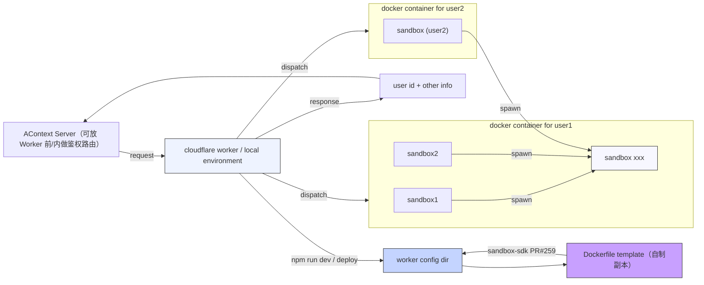

# Artifact Sandbox

一个基于 Cloudflare Workers + Sandbox SDK 的最小示例，演示“为每个用户创建独立容器，提供命令执行与文件读写”能力。目录同时包含 Worker 服务端与 Python 轻量客户端。

## 设计目的
- 快速验证 Sandbox SDK 在 Worker 中的接入方式、接口设计与部署流程。
- 演示多 Sandbox 场景：不同用户/租户可绑定不同的 Sandbox ID，隔离命令执行与文件操作。
- 方便本地/预发环境用 curl 或简单脚本完成端到端联调。

## 目录
- `server/`：Worker 代码、Sandbox 容器定义与部署说明。
- `client/`：Python 轻量客户端，封装 `/run` 与 `/file` 调用。

## 架构示意


## 服务端用法（概览）
在 `server/` 目录内按 README 详细步骤操作：
```bash
cd artifact_sandbox/server
npm install
npm run dev   # 或 wrangler dev
```
- 首次启动会构建 `Dockerfile` 指定的 Sandbox 容器，并在控制台输出 Sandbox ID。
- 调用接口时必须在请求头 `x-sandbox-id`（或查询参数 `sandbox_id`）传入该 ID。
- 主要接口：`POST /run` 执行命令；`PUT/GET/DELETE /file` 写/读/删文件；`GET /file?mode=download` 下载。
更多细节与 curl 示例见 `server/README.md`。

## 客户端用法（Python）
位置：`client/client.py`

1) 安装依赖（仅 `requests`）：
```bash
pip install requests
```
2) 设置目标：`SANDBOX_BASE_URL`（默认 `http://localhost:8787`）与 `SANDBOX_ID`。
3) 运行示例测试套件（读写/下载/执行命令）：
```bash
export SANDBOX_ID=<你的 Sandbox ID>
python client/client.py
```
或在代码中直接构造：
```python
from client import client as c
cli = c.SandboxClient(sandbox_id="<ID>", base_url="http://localhost:8787")
resp = cli.run("python3 -c \"print(2+2)\"")
print(resp.json())
```

## 典型流程
1) 本地 `npm run dev` 启动 Worker，获取 Sandbox ID。  
2) 用 curl / Python 客户端携带 `x-sandbox-id` 调接口。  
3) 验证命令执行与文件读写，必要时更新 `Dockerfile` 后由 Wrangler 重建 Sandbox 镜像。  
4) `npm run deploy` 部署到 Cloudflare，客户端只需切换 `base_url` 与 Sandbox ID。
