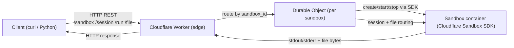
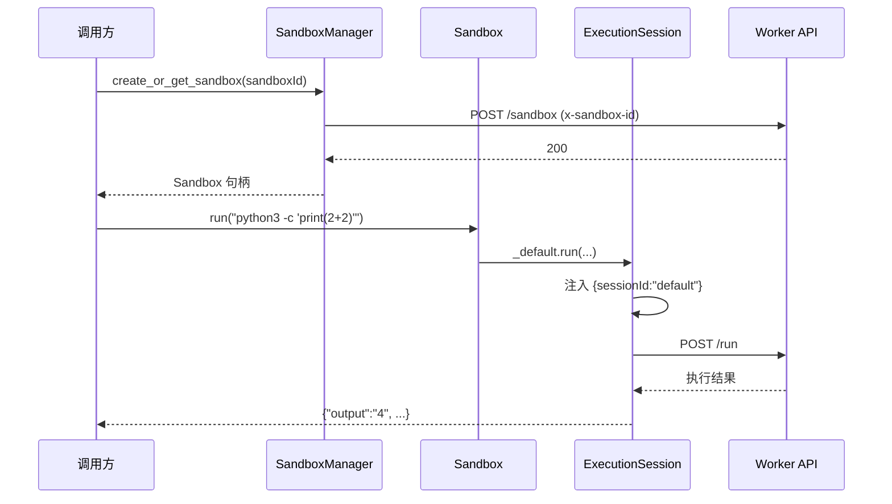

# Artifact Sandbox

Minimal reference for running per-tenant containers on Cloudflare Workers using the Sandbox SDK. The repo ships a Worker backend and a lightweight Python client to exercise the HTTP APIs end to end.

## Goals
- Validate how Sandbox SDK integrates with Workers, including lifecycle, execution, and file APIs.
- Demonstrate multi-tenant isolation: each user/tenant binds to its own Sandbox ID.
- Provide simple curl/Python flows for local or pre-prod verification.

## Repository layout
- `server/`: Worker code, Dockerfile template, and deployment scripts.
- `client/`: Python client that wraps `/sandbox`, `/session`, `/run`, and `/file` endpoints.
- `server/API_DOCUMENTATION.md`: Detailed HTTP API reference.

## Current architecture
- Runtime: Cloudflare Workers (Edge Runtime).
- State: Durable Objects hold sandbox metadata and session bookkeeping.
- Containers: Cloudflare Sandbox Docker image (via the bundled Dockerfile template).
- API: REST over HTTP; Sandbox ID supplied via `x-sandbox-id` header or `sandbox_id` query.
- Isolation model: each Sandbox ID maps to its own container; sessions inside the container isolate cwd/env.

## Architecture diagram


## Client SDK design

Python 客户端采用三层拆分，便于职责清晰、连接复用、错误集中处理。

- `SandboxManager`：管理所有沙盒 ID，封装底层 HTTP 请求与 `x-sandbox-id` 头部注入，复用 `requests.Session`，并缓存 `Sandbox` 句柄。
- `Sandbox`：单沙盒门面，持有 `sandbox_id` 和 manager；懒加载默认会话 `_default_session`（ID `"default"`），对外暴露文件/命令/会话等便捷方法。
- `ExecutionSession`：单会话上下文，向请求自动注入 `sessionId`，提供文件/目录/命令/挂载 bucket 等操作，统一抛出 `SandboxError`。

时序示意（默认会话）：


## Server quickstart
Run inside `server/`:
```bash
cd artifact_sandbox/server
npm install
npm run dev   # or wrangler dev
```
- First run builds the Docker image and prints an initial Sandbox ID.
- Key endpoints: `POST /sandbox` (create/destroy), `POST /session`, `POST /run`, `PUT/GET/DELETE /file`, and `GET /file?mode=download`.
- See `server/API_DOCUMENTATION.md` for request/response shapes and curl examples.

## Python client
Location: `client/client.py`
```bash
pip install requests
export SANDBOX_ID=<your sandbox id>
python client/client.py
```
Or construct directly:
```python
from client import client as c
cli = c.SandboxClient(sandbox_id="<ID>", base_url="http://localhost:8787")
resp = cli.run("python3 -c \"print(2+2)\"")
print(resp.json())
```

## Typical flow
1) Start the Worker locally (`npm run dev`) and note the Sandbox ID.
2) Call the APIs with `x-sandbox-id` (or `?sandbox_id=`) using curl or the Python client.
3) Validate command execution and file I/O; adjust the Dockerfile if you need a different toolchain.
4) Deploy with `npm run deploy`; clients only switch `base_url` and Sandbox ID.
