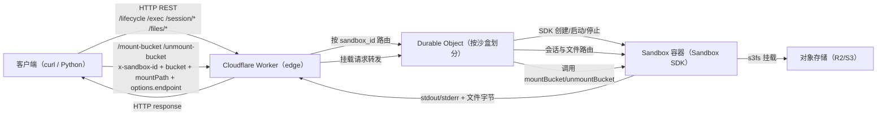
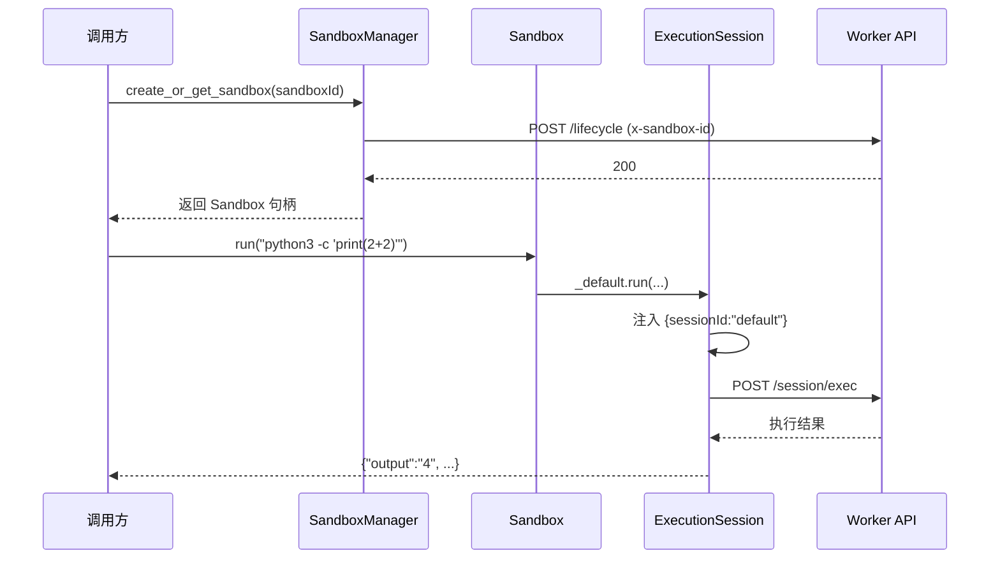

# Artifact Sandbox

最小参考项目：基于 Cloudflare Workers + Sandbox SDK 运行“每租户一容器”。仓库包含 Worker 后端与轻量 Python 客户端，方便端到端体验 HTTP 接口。

## 目标
- 验证 Sandbox SDK 在 Workers 中的生命周期、执行与文件 API。
- 演示多租户隔离：每个用户/租户绑定独立 Sandbox ID。
- 提供 curl/Python 的本地或预发布快速验证流程。

## 仓库结构
- `server/`：Worker 代码、Dockerfile 模板、部署脚本。
- `client/`：Python 客户端，封装 `/lifecycle`、`/exec`、`/session/*`、`/files/*`、`/mount-bucket`、`/unmount-bucket` 等端点，三层（manager → sandbox → session），manager 为顶层封装。
- `client/test_mount_persistence.py`：Bucket 挂载持久化冒烟测试（写入 -> 销毁沙盒 -> 重新挂载 -> 校验文件一致性）。
- `lab/`、`other/`：本地草稿，已 gitignore，避免产生噪声。

## 当前架构
- 运行时：Cloudflare Workers（Edge Runtime）。
- 状态：Durable Objects 持久化沙盒元数据与会话记录。
- 容器：Cloudflare Sandbox Docker 镜像（使用仓库内 Dockerfile 模板）。
- API：HTTP REST；Sandbox ID 通过 `x-sandbox-id` 头传递；支持 `/mount-bucket` / `/unmount-bucket` 进行对象存储挂载/卸载。
- 隔离：每个 Sandbox ID 对应独立容器；容器内的会话隔离工作目录与环境。

## 架构示意


## Python 客户端设计

客户端分三层，便于职责清晰、连接复用、错误集中处理：
- `SandboxManager`：管理全部 Sandbox ID，封装 HTTP 与 `x-sandbox-id` 注入，复用 `requests.Session` 并缓存 `Sandbox` 句柄。
- `Sandbox`：单沙盒门面，持有 `sandbox_id` 与 manager；懒加载默认会话 `_default_session`（ID `"default"`），暴露文件/命令/会话等便捷方法。
- `ExecutionSession`：单会话上下文，自动注入 `sessionId`，提供文件/目录/命令/挂载 bucket 等操作，统一抛出 `SandboxError`。

默认会话时序：


## 服务端快速开始
在 `server/`：
```bash
cd artifact_sandbox/server
npm install
npm run dev   # 或 wrangler dev
```
- 首次运行会构建 Docker 镜像并输出初始 Sandbox ID。
- 关键端点（均需 `x-sandbox-id` 请求头）：
  - `/lifecycle`：POST 创建/初始化沙盒，DELETE 销毁。
  - `/exec`：非会话命令执行。
  - `/session`：POST 创建会话，DELETE 删除会话（`session_id` query）。
  - `/session/exec`：指定会话执行命令（body/params 传 `sessionId`/`session_id`）。
  - `/session/env`：设置/覆盖会话环境变量。
  - `/files/*`：write/read/mkdir/rename/move/delete/exists。
  - `/mount-bucket`（POST，要求 `options.endpoint`，可选 `provider/credentials/readOnly/s3fsOptions`，支持 session 级挂载）。
  - `/unmount-bucket`（DELETE/POST，支持 session 级卸载）。
- 请求/响应形态：参见 `server/src/index.ts` 中的路由与参数约定，或使用 curl 直接调用验证。

## Wrangler 配置与部署
- 获取 Cloudflare API Token（用于 `wrangler deploy`）：
  1. 打开浏览器访问 Cloudflare Dashboard。
  2. 进入：https://dash.cloudflare.com/profile/api-tokens
  3. 创建一枚 Token，授予 “Edit Cloudflare Workers” 权限（或使用模板 “Edit Cloudflare Workers”），并绑定目标账号。
  4. 将 Token 配置为环境变量 `CLOUDFLARE_API_TOKEN`（或按 wrangler 文档配置）。
- 获取其他凭据：
  - `CLOUDFLARE_ACCOUNT_ID`：Dashboard → Workers & Pages → 任一 Worker → 右侧“API”卡片。
  - `AWS_ACCESS_KEY_ID` / `AWS_SECRET_ACCESS_KEY`：从目标云存储账号的访问密钥页面获取（R2 在 “R2 → Manage R2 API Tokens”，或使用 S3 兼容凭据）。
- 部署步骤（假设已在 `artifact_sandbox/server`）：
```bash
npm install          # 首次或依赖更新
npm run build        # 可选，验证构建
npm run deploy       # 等价于 wrangler deploy，需 CLOUDFLARE_API_TOKEN
```
## Wrangler 配置与部署
- `server/wrangler.jsonc` 中的 `containers` 段（`class_name: "Sandbox", image: "./Dockerfile", instance_type: "lite"`）定义了容器模板；每个 Sandbox ID 会对应一个独立容器实例，最多并发实例数由 `max_instances` 控制。
- 获取 Cloudflare API Token（用于 `wrangler deploy`）：
  1. 打开浏览器访问 Cloudflare Dashboard。
  2. 进入：https://dash.cloudflare.com/profile/api-tokens
  3. 创建一枚 Token，授予 “Edit Cloudflare Workers” 权限（或使用模板 “Edit Cloudflare Workers”），并绑定目标账号。
  4. 将 Token 配置为环境变量 `CLOUDFLARE_API_TOKEN`（或按 wrangler 文档配置）。
- 获取其他凭据：
  - `CLOUDFLARE_ACCOUNT_ID`：Dashboard → Workers & Pages → 任一 Worker → 右侧“API”卡片。
  - `AWS_ACCESS_KEY_ID` / `AWS_SECRET_ACCESS_KEY`：从目标云存储账号的访问密钥页面获取（R2 在 “R2 → Manage R2 API Tokens”，或使用 S3 兼容凭据）。
- 部署步骤（假设已在 `artifact_sandbox/server`）：
```bash
npm install          # 首次或依赖更新
npm run build        # 可选，验证构建
npm run deploy       # 等价于 wrangler deploy，需 CLOUDFLARE_API_TOKEN
```

## Python 客户端用法
入口：`client/client.py`
```bash
pip install requests python-dotenv
export SANDBOX_BASE_URL=http://localhost:8787
python client/client.py
```
或直接构造：
```python
from client.client import SandboxManager

manager = SandboxManager(base_url="http://localhost:8787")
sandbox = manager.create_or_get_sandbox("sb-123")

print(sandbox.run("python3 -c \"print(2+2)\"")["output"])

# 挂载 bucket（必须提供 options.endpoint；不填 credentials 则尝试使用 Worker 环境变量）
sandbox.mount_bucket(
    bucket="my-bucket",
    mount_path="/data",
    options={"endpoint": "https://<account>.r2.cloudflarestorage.com", "provider": "r2"}
)
# 卸载
sandbox.unmount_bucket("/data")
```

## 典型验证流程
1) 本地启动 Worker（`npm run dev`），记下 Sandbox ID。
2) 用 curl 或 Python 客户端，**必须**带 `x-sandbox-id` 调用接口（服务端不接受 query 传递）。
3) 验证命令执行与文件读写；如需额外工具链可调整 Dockerfile。
4) `npm run deploy` 部署；客户端只需切换 `base_url` 与 Sandbox ID。

## 关键实现指引
- 客户端：`client/client.py`，内置代理自动探测（Clash/HTTP/SOCKS5）、`SandboxManager`/`Sandbox`/`ExecutionSession` 三层封装，以及文件、命令、挂载、会话等便捷方法。
- Worker 路由：`server/src/index.ts`，集中处理 `/lifecycle`、`/exec`、`/session/*`、`/files/*`、`/mount-bucket`、`/unmount-bucket`，并通过 `x-sandbox-id` 选路。
- Wrangler 配置：`server/wrangler.jsonc`，定义容器镜像、Durable Object 绑定、兼容性日期与可选的环境变量/密钥说明（含 AWS/R2 凭据提示）。
